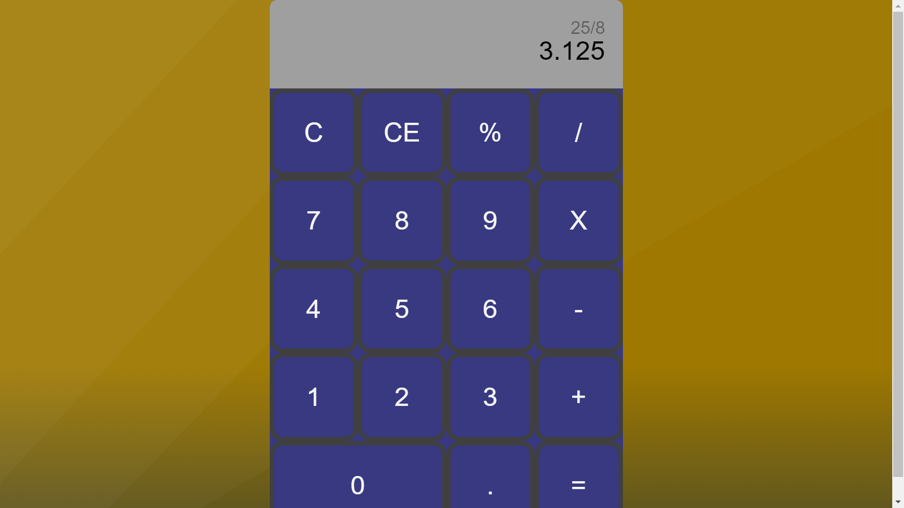

# Js Calculator

A calculator created with vanilla JavaScript Html and Css

## Built With

- HTML
- CSS
- Javascript

## Live Demo

## Getting Started

Download repository 
Open index.html in a web browser

## Authors

👤 **Anibal Amoroso**

- GitHub: (https://github.com/sj1978)

## Show your support

Give a ⭐️ if you like this project!

## Acknowledgments

## 📝 License

This project is [MIT](./MIT.md) licensed.